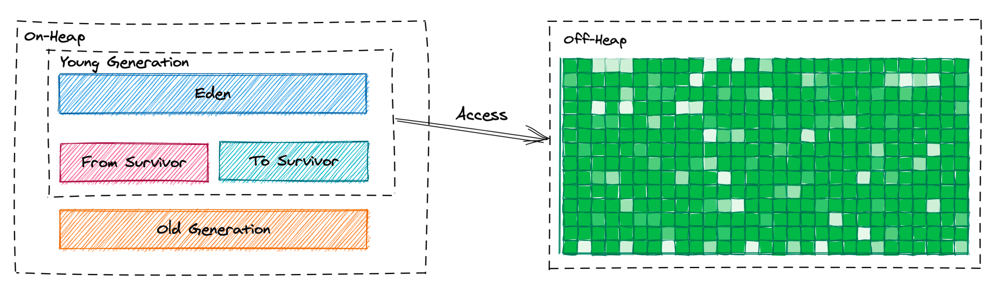

# java 14 新特性总结

### 1. switch 表达式(从早期版本继承)

switch 表达式在之前的 Java 12 和 Java 13 中都是处于预览阶段，而在这次更新的 Java 14 中，终于成为稳定版本，能够正式可用。

### 2. 改进 NullPointerExceptions 提示信息

Java 14 改进 NullPointerException 的可查性、可读性，能更准确地定位 null 变量的信息。
该特性能够帮助开发者和技术支持人员提高生产力，以及改进各种开发工具和调试工具的质量，能够更加准确、清楚地根据动态异常与程序代码相结合来理解程序。

Java 14 中，则做了对 NullPointerException 打印异常信息的改进增强，通过分析程序的字节码信息，
能够做到准确的定位到出现 NullPointerException 的变量，并且根据实际源代码打印出详细异常信息，对于上述示例，打印信息如下：

具体代码可见：`icu.zheteng.NullDemo`,可以通过在 vm 添加参数：`-XX:+ShowCodeDetailsInExceptionMessages`

```
Exception in thread "main" java.lang.NullPointerException: Cannot invoke "icu.zheteng.NullDemo$C.doC()" because "b.c" is null
	at icu.zheteng.NullDemo.main(NullDemo.java:10)
```

### 3. G1 de  NUMA 可识别内存分配

Java 14 改进非一致性内存访问（NUMA）系统上的 G1 垃圾收集器的整体性能，主要是对年轻代的内存分配进行优化，从而提高 CPU 计算过程中内存访问速度。

NUMA 是 non-unified memory access 的缩写，主要是指在当前的多插槽物理计算机体系中，比较普遍是多核的处理器，
并且越来越多的具有 NUMA 内存访问体系结构，即内存与每个插槽或内核之间的距离并不相等。
同时套接字之间的内存访问具有不同的性能特征，对更远的套接字的访问通常具有更多的时间消耗。
这样每个核对于每一块或者某一区域的内存访问速度会随着核和物理内存所在的位置的远近而有不同的时延差异。

Java 中，堆内存分配一般发生在线程运行的时候，当创建了一个新对象时，该线程会触发 G1 去分配一块内存出来，用来存放新创建的对象，
在 G1 内存体系中，其实就是一块 region（大对象除外，大对象需要多个 region），在这个分配新内存的过程中，如果支持了 NUMA 感知内存分配，
将会优先在与当前线程所绑定的 NUMA 节点空闲内存区域来执行 allocate 操作，同一线程创建的对象，尽可能的保留在年轻代的同一 NUMA 内存节点上，
因为是基于同一个线程创建的对象大部分是短存活并且高概率互相调用的。

具体启用方式可以在 JVM 参数后面加上如下参数:

```
-XX:+UseNUMA
```

### 4. 删除 CMS 垃圾回收期

CMS 是老年代垃圾回收算法，通过标记-清除的方式进行内存回收，在内存回收过程中能够与用户线程并行执行。 
CMS 回收器可以与 Serial 回收器和 Parallel New 回收器搭配使用，CMS 主要通过并发的方式， 适当减少系统的吞吐量以达到追求响应速度的目的，比较适合在追求 GC 速度的服务器上使用。

因为 CMS 回收算法在进行 GC 回收内存过程中是使用并行方式进行的，如果服务器 CPU 核数不多的情况下，进行 CMS 垃圾回收有可能造成比较高的负载。
同时在 CMS 并行标记和并行清理时，应用线程还在继续运行，程序在运行过程中自然会创建新对象、释放不用对象，所以在这个过程中，
会有新的不可达内存地址产生，而这部分的不可达内存是出现在标记过程结束之后，本轮 CMS 回收无法在周期内将它们回收掉，
只能留在下次垃圾回收周期再清理掉。这样的垃圾就叫做浮动垃圾。由于垃圾收集和用户线程是并发执行的，因此 CMS 回收器不能像其他回收器那样进行内存回收，
需要预留一些空间用来保存用户新创建的对象。由于 CMS 回收器在老年代中使用标记-清除的内存回收策略，势必会产生内存碎片，
内存当碎片过多时，将会给大对象分配带来麻烦，往往会出现老年代还有空间但不能再保存对象的情况。

所以，早在几年前的 Java 9 中，就已经决定放弃使用 CMS 回收器了，而这次在 Java 14 中，是继之前 Java 9 中放弃使用 CMS 之后，彻底将其禁用，
并删除与 CMS 有关的选项，同时清除与 CMS 有关的文档内容，至此曾经辉煌一度的 CMS 回收器，也将成为历史。

### 5. ZGC 支持 MacOS 和 windows 系统 （实验阶段）

ZGC 最初是在 java11 中引入，此次 Java 14，同时支持 MacOS 和 Windows 系统，解决了开发人员需要在桌面操作系统中使用 ZGC 的问题。

需要添加 JVM 参数：
` -XX:+UnlockExperimentalVMOptions -XX:+UseZGC `

### 6. 弃用 ParallelScavenge 和 SerialOld GC 的组合使用

由于 Parallel Scavenge 和 Serial Old 垃圾收集算法组合起来使用的情况比较少，并且在年轻代中使用并行算法，而在老年代中使用串行算法，
这种并行、串行混搭使用的情况，本身已属罕见同时也很冒险。由于这两 GC 算法组合很少使用，却要花费巨大工作量来进行维护，
所以在 Java 14 版本中，考虑将这两 GC 的组合弃用。

具体弃用情况如下，通过弃用组合参数：-XX:+UseParallelGC -XX:-UseParallelOldGC，来弃用年轻代、老年期中并行、串行混搭使用的情况；
同时，对于单独使用参数：-XX:-UseParallelOldGC 的地方，也将显示该参数已被弃用的警告信息。


### 7. instanceof 模式匹配 （预览阶段）

Java 14 中对 instanceof 的改进，主要目的是为了创建对象更简单、简介和高效，并且可读性更强、提高安全性。

在以往实际使用中，instanceof 主要用来检查对象的类型，然后根据对目标进行类型转换，之后进行不同的处理，实现不同的逻辑，现在可以将代码写成模式匹配的方式

[instanceof 匹配](../java16/src/main/java/icu/zheteng/InstanceOfDemo.java)


### 8. Record 类型（预览功能）

Record 类型允许在代码中使用紧凑的语法形式来声明类，而这些类能够作为不可变数据类型的封装持有者。
Record 这一特性主要用在特定领域的类上；与枚举类型一样，Record 类型是一种受限形式的类型，主要用于存储、保存数据，并且没有其它额外自定义行为的场景下。


[Record 类型](../java16/src/main/java/icu/zheteng/RecordDemo.java)

### 9. 文本块（第二预览版本）

Java 14 在 Java 13 引入的文本块的基础之上，新加入了两个转义符，分别是：\ 和 \s，这两个转义符分别表达涵义如下：

- \ : 行终止符，主要用于阻止插入换行符
- \s : 表示一个空格。可以用来避免末尾的白字符被去掉。

### 10. 打包工具（孵化器版本）

创建用于打包自包含 Java 应用程序的工具

它基于 JavaFX javapackager 工具创建一个简单的打包工具，主要目标是：
- 支持原生打包格式，为最终用户提供自然的安装体验。这些格式包括 Windows 上的 msi 和 exe，macOS 上的 pkg 和 dmg， 以及 Linux 上的 deb 和 rpm。
- 允许在打包时指定启动时间参数。
- 可以从命令行直接调用，也可以通过 ToolProvider API 以编程方式调用。


### 11. 外部存储器访问（孵化器版本）

外存访问 API（二次孵化），可以允许 Java 应用程序安全有效地访问 Java 堆之外的外部内存。
目的是引入一个 API，以允许 Java 程序安全、有效地访问 Java 堆之外的外部存储器。如本机、持久和托管堆。

在实际的开发过程中，绝大多数的开发人员基本都不会直接与堆外内存打交道，但这并不代表你从未接触过堆外内存，
像大家经常使用的诸如：RocketMQ、MapDB 等中间件产品底层实现都是基于堆外存储的，换句话说，我们几乎每天都在间接与堆外内存打交道。
那么究竟为什么需要使用到堆外内存呢？简单来说，主要是出于以下 3 个方面的考虑：

- 减少 GC 次数和降低 Stop-the-world 时间； 
- 可以扩展和使用更大的内存空间； 
- 可以省去物理内存和堆内存之间的数据复制步骤。

在 Java14 之前，如果开发人员想要操作堆外内存，通常的做法就是使用 ByteBuffer 或者 Unsafe，甚至是 JNI 等方式，
但无论使用哪一种方式，均无法同时有效解决安全性和高效性等 2 个问题，并且，堆外内存的释放也是一个令人头痛的问题。
以 DirectByteBuffer 为例，该对象仅仅只是一个引用，其背后还关联着一大段堆外内存，由于 DirectByteBuffer 对象实例仍然是存储在堆空间内，
只有当 DirectByteBuffer 对象被 GC 回收时，其背后的堆外内存才会被进一步释放。



程序中通过 ByteBuffer.allocateDirect()方法来申请物理内存资源所耗费的成本远远高于直接在 on-heap 中的操作，
而且实际开发过程中还需要考虑数据结构如何设计、序列化/反序列化如何支撑等诸多难题，
所以与其使用语法层面的 API 倒不如直接使用 MapDB 等开源产品来得更实惠。

如今，在堆外内存领域，我们似乎又多了一个选择，从 Java14 开始，Java 的设计者们在语法层面为大家带来了崭新的 Memory Access API，
极大程度上简化了开发难度，并得以有效的解决了安全性和高效性等 2 个核心问题。

示例：

[外部存储器访问 示例](../java16/src/main/java/icu/zheteng/MemoryAccessDemo.java)

在启动java程序的时候需要添加模块：jdk.incubator.foreign，启动命令：
```shell
/Library/Java/JavaVirtualMachines/jdk-16.0.2.jdk/Contents/Home/bin/java --add-modules jdk.incubator.foreign /java-new-feature/java-new-feature/java16/src/main/java/icu/zheteng/MemoryAccessDemo.java
```


