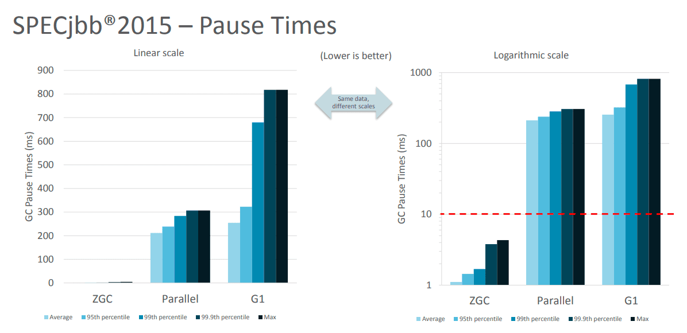

# java 15 新特性总结

Java 15 是短期过度版本

### 1. 文本块

经过 Java 13 和 14 的更新，在 Java 15 被确定下来，可以放心使用。

[文本块](src/main/java/icu/zheteng/TextBlockTest.java)

### 2. Edwards-Curve 数字签名算法 (EdDSA)

Edwards-Curve 数字签名算法（EdDSA），一种根据 RFC 8032 规范所描述的 Edwards-Curve 数字签名算法（EdDSA）实现加密签名，实现了一种 RFC 8032 标准化方案，但它不能代替 ECDSA。

与 JDK 中的现有签名方案相比，EdDSA 具有更高的安全性和性能，因此备受关注。它已经在OpenSSL和BoringSSL等加密库中得到支持，在区块链领域用的比较多。

EdDSA是一种现代的椭圆曲线方案，具有JDK中现有签名方案的优点。EdDSA将只在SunEC提供商中实现。

[Edwards-Curve 数字签名算法](src/main/java/icu/zheteng/EdwardsTest.java)

### 3. 隐藏类 Hidden Classes

隐藏类是为框架（frameworks）所设计的，隐藏类不能直接被其他类的字节码使用，只能在运行时生成类并通过反射间接使用它们。

该提案通过启用标准 API 来定义 无法发现 且 具有有限生命周期 的隐藏类，从而提高 JVM 上所有语言的效率。JDK内部和外部的框架将能够动态生成类，而这些类可以定义隐藏类。通常来说基于JVM的很多语言都有动态生成类的机制，这样可以提高语言的灵活性和效率。

- 隐藏类天生为框架设计的，在运行时生成内部的class。
- 隐藏类只能通过反射访问，不能直接被其他类的字节码访问。
- 隐藏类可以独立于其他类加载、卸载，这可以减少框架的内存占用。

Hidden Classes就是不能直接被其他class的二进制代码使用的class。Hidden Classes主要被一些框架用来生成运行时类，但是这些类不是被用来直接使用的，而是通过反射机制来调用。

[隐藏类](src/main/java/icu/zheteng/HiddenClassTest.java)

### 4. 重新实现 DatagramSocket API

重新实现了老的 DatagramSocket API 接口，更改了 java.net.DatagramSocket 和 java.net.MulticastSocket 为更加简单、现代化的底层实现，更易于维护和调试。

java.net.datagram.Socket和java.net.MulticastSocket的当前实现可以追溯到JDK 1.0，那时IPv6还在开发中。因此，当前的多播套接字实现尝试调和IPv4和IPv6难以维护的方式。

- 通过替换 java.net.datagram 的基础实现，重新实现旧版 DatagramSocket API。
- 更改java.net.DatagramSocket 和 java.net.MulticastSocket 为更加简单、现代化的底层实现。
- 提高了 JDK 的可维护性和稳定性。通过将java.net.datagram.Socket和java.net.MulticastSocket API的底层实现替换为更简单、更现代的实现来重新实现遗留的DatagramSocket API。

新的实现：

- 易于调试和维护;
- 与Project Loom中正在探索的虚拟线程协同

### 5. ZGC: 可伸缩低延迟垃圾收集器

ZGC是Java 11引入的新的垃圾收集器（JDK9以后默认的垃圾回收器是G1），经过了多个实验阶段，自此终于成为正式特性。
ZGC是一个重新设计的并发的垃圾回收器，可以极大的提升GC的性能。支持任意堆大小而保持稳定的低延迟（10ms以内），性能非常可观。
目前默认垃圾回收器仍然是 G1，后续很有可以能将ZGC设为默认垃圾回收器。
之前需要通过-XX:+UnlockExperimentalVMOptions -XX:+UseZGC来启用ZGC，现在只需要-XX:+UseZGC就可以。

ZGC 是一个可伸缩的、低延迟的垃圾收集器，主要为了满足如下目标进行设计：

- GC 停顿时间不超过 10ms
- 即能处理几百 MB 的小堆，也能处理几个 TB 的大堆
- 应用吞吐能力不会下降超过 15%（与 G1 回收算法相比）
- 方便在此基础上引入新的 GC 特性和利用 colord
- 针以及 Load barriers 优化奠定基础
- 当前只支持 Linux/x64 位平台 停顿时间在 10ms 以下，10ms 其实是一个很保守的数据，即便是 10ms 这个数据，也是 GC 调优几乎达不到的极值。根据 SPECjbb 2015 的基准测试，128G 的大堆下最大停顿时间才 1.68ms，远低于 10ms，和 G1 算法相比，改进非常明显。

不过目前 ZGC 还处于实验阶段，目前只在 Linux/x64 上可用，如果有足够的需求，将来可能会增加对其他平台的支持。同时作为实验性功能的 ZGC 将不会出现在 JDK 构建中，除非在编译时使用 configure 参数： --with-jvm-features=zgc 显式启用。
在实验阶段，编译完成之后，已经迫不及待的想试试 ZGC，需要配置以下 JVM 参数，才能使用 ZGC，具体启动 ZGC 参数如下：

`-XX：+ UnlockExperimentalVMOptions -XX：+ UseZGC -Xmx10g`

其中参数： -Xmx 是 ZGC 收集器中最重要的调优选项，大大解决了程序员在 JVM 参数调优上的困扰。ZGC 是一个并发收集器，必须要设置一个最大堆的大小，应用需要多大的堆，主要有下面几个考量：

- 对象的分配速率，要保证在 GC 的时候，堆中有足够的内存分配新对象。
- 一般来说，给 ZGC 的内存越多越好，但是也不能浪费内存，所以要找到一个平衡。

### 6. 禁用偏向锁定

准备禁用和废除偏向锁，在 JDK 15 中，默认情况下禁用偏向锁，并弃用所有相关的命令行选项。

在默认情况下禁用偏向锁定，并弃用所有相关命令行选项。目标是确定是否需要继续支持偏置锁定的 高维护成本 的遗留同步优化， 
HotSpot虚拟机使用该优化来减少非竞争锁定的开销。 尽管某些Java应用程序在禁用偏向锁后可能会出现性能下降，但偏向锁的性能提高通常不像以前那么明显。

该特性默认禁用了biased locking(-XX:+UseBiasedLocking)，并且废弃了所有相关的命令行选型(BiasedLockingStartupDelay, BiasedLockingBulkRebiasThreshold, BiasedLockingBulkRevokeThreshold, BiasedLockingDecayTime, UseOptoBiasInlining, PrintBiasedLockingStatistics and PrintPreciseBiasedLockingStatistics)#

### 7. Shenandoah：低暂停时间垃圾收集器(转正)

Shenandoah垃圾回收算法终于从实验特性转变为产品特性，这是一个从 JDK 12 引入的回收算法，该算法通过与正在运行的 Java 线程同时进行疏散工作来减少 GC 暂停时间。Shenandoah 的暂停时间与堆大小无关，无论堆栈是 200 MB 还是 200 GB，都具有相同的一致暂停时间。

Shenandoah适用于高吞吐和大内存场景，不适合高实时性场景。Shenandoah算法设计目标主要是响应性和一致可控的短暂停顿，对于垃圾回收生命周期中安全点停顿（TTSP)和内存增长监控的时间开销并无帮助。

Shenandoah算法为每个Java对象添加了一个间接指针，使得GC线程能够在Java线程运行时压缩堆。标记和压缩是同时执行的，因此我们只需要暂停Java线程在一致可控的时间内扫描线程堆栈以查找和更新对象图的根。

怎么形容Shenandoah和ZGC的关系呢？异同点大概如下：

- 相同点：性能几乎可认为是相同的
- 不同点：ZGC是Oracle JDK的。而Shenandoah只存在于OpenJDK中，因此使用时需注意你的JDK版本
- 打开方式：使用-XX:+UseShenandoahGC命令行参数打开。

Shenandoah在JDK12被作为experimental引入，在JDK15变为Production；之前需要通过-XX:+UnlockExperimentalVMOptions -XX:+UseShenandoahGC来启用，现在只需要-XX:+UseShenandoahGC即可启用

### 8. 移除Nashorn JavaScript引擎

移除了 Nashorn JavaScript 脚本引擎、APIs，以及 jjs 工具。这些早在 JDK 11 中就已经被标记为 deprecated 了，JDK 15 被移除就很正常了。

#### Nashorn引擎是什么？

Nashorn 是 JDK 1.8 引入的一个 JavaScript 脚本引擎，用来取代 Rhino 脚本引擎。Nashorn 是 ECMAScript-262 5.1 的完整实现，增强了 Java 和 JavaScript 的兼容性，并且大大提升了性能。

#### 为什么要移除？

官方的描述是，随着 ECMAScript 脚本语言的结构、API 的改编速度越来越快，维护 Nashorn 太有挑战性了 。

### 9. instanceof 自动匹配模式（第二次预览）

Java 15 并没有对此特性进行调整，继续预览特性

### 10. 密封的类和接口（预览）

封闭类（预览特性），可以是封闭类也可以是封闭接口，用来增强 Java 编程语言， 防止其他类或者接口扩展或实现它们。

因为引入了 `sealed` class 或者 interface ， 这些 class 或者 interface 只允许被指定的类或者接口进行扩展和实现。

使用修饰符 `sealed`，您可以将一个类声明为密封类。密封的类使用 reserved 关键字 permits 列出可以直接扩展它的类。子类可以是final的，非密封的或密封的

密封类可以限制类的层次结构

### 11. 外部存储器访问 API（二次孵化器版）

[外部存储器访问](../java14/README.md#11-外部存储器访问孵化器版本)

### 12. Records (二次预览)

Records 最早在 JDK 14 中成为预览特性， JDK 15 继续二次预览

[Records](../java14/README.md#8-record-类型预览功能)

