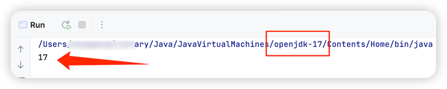
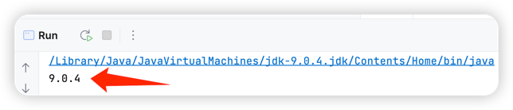
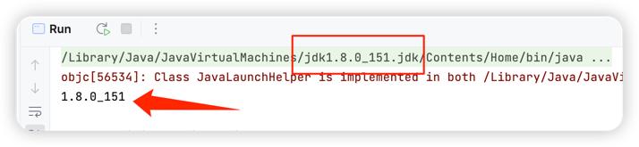

# java 9新特性总结

### 1. 模块化

[模块化](oop-module-1/README.md)

### 2. 新的版本字符串格式

##### 2.1 简介

通过新的字符串版本格式能够更容易区分**主要**、**次要**和**安全更新**版本。
如果在你的程序中有使用到java版本的地方请务必注意！如：`System.getProperty("java.version")`

##### 2.2 代码
通过不同的jdk去运行`java9/src/main/java/icu/zheteng/NewVersionStringTest.java`代码，
能够体会不同的版本之间版本号格式的区分。





##### 2.3引用
[JEP 223: New Version-String Scheme](https://openjdk.org/jeps/223)

### 3. JShell 工具

##### 3.1 简介

提供一个交互式工具来评估 Java 编程语言的声明、语句和表达式，以及一个 API，以便其他应用程序可以利用此功能。

##### 3.2 使用

```
#  通过jshell命令进入
$ jshell

|  欢迎使用 JShell -- 版本 17
|  要大致了解该版本, 请键入: /help intro

jshell> int add(int a,int b){return a+b;}
|  已创建 方法 add(int,int)

jshell> add(1,2)
$2 ==> 3

jshell> 3+3
$3 ==> 6
```

##### 3.3 引用

[JEP 222: jshell: The Java Shell (Read-Eval-Print Loop)](https://openjdk.org/jeps/222)

### 4. 使用G1作为默认垃圾回收器

##### 4.1 简介

使用G1作为32位和64位服务器默认垃圾回收器

##### 4.2 动机

通常，限制 GC 暂停时间比最大化吞吐量更重要。对于大多数用户来说，切换到 G1 等低暂停收集器应该会提供比当前默认的并行 GC 等面向吞吐量的收集器更好的整体体验。

在 JDK 8 及其更新版本中对 G1 进行了许多性能改进，并计划在 JDK 9 中进一步改进。在 JDK 8u40 中引入并发类卸载 (JEP 156) 使 G1 成为功能齐全的垃圾收集器，准备成为默认。

##### 4.3 引用

[JEP 248: Make G1 the Default Garbage Collector](https://openjdk.org/jeps/248)

### 5. 私有接口方法

##### 5.1 简介

在Java 9中，引入了一项名为“私有接口”的新特性，该特性允许在接口中定义私有方法。
私有接口可以是 private 的，它只能被同一接口的其他默认方法或静态方法所调用，从而限制了接口方法的可见性。

##### 5.3 代码

在`java9/src/main/java/icu/zheteng/PrivateInterfaceMethodTest.java`代码中，
定义了两个默认方法，一个是偶数相加，一个书奇数相加，在两个默认方法中都复用了`doAdd`方法

##### 5.2 作用

1. 提高代码的复用率
2. 提高代码的可读性和可维护性
3. 避免接口方法的代码冗余
4. 避免接口方法的代码泄漏

### 6. Stream API 的增强

1. 支持无限流,generate()和iterate()都可以生成无限流，示例代码是：`icu.zheteng.StreamAPITest.unlimitedStreamTest`
2. stream.ofNullable 创建空的流和只包含一个元素的流，示例代码是：`icu.zheteng.StreamAPITest.ofNullableTest`
3. stream.takeWhile() 在遇到不满足指定条件的元素时停止 Stream 的操作，示例代码是：`icu.zheteng.StreamAPITest.takeWhileTest`
5. stream.dropWhileUse() 与 takeWhile() 方法相反，它会删除满足指定条件的元素，直到遇到不满足该条件的元素为止，示例代码是：`icu.zheteng.StreamAPITest.dropWhileTest`
6. Stream API 的性能优化。 Java 9 对 Stream API 进行了一些性能优化，其中最显著的是针对 toArray() 方法的优化，现在 toArray() 方法可以直接使用底层数组，这可以避免了创建中间数组的开销，从而提高了性能。

### 7. Optional 类改进

1. ifPresentOrElse(),如果存在就执行第一个操作，如果不存在就执行第二个操作。示例代码是：`icu.zheteng.OptionalTest.ifPresentOrElseTest`
2. or(),允许我们在Optional对象为空的情况下返回一个默认值。示例代码是：`icu.zheteng.OptionalTest.orTest`
3. stream(),允许我们将Optional对象转换成一个Stream对象。示例代码是：`icu.zheteng.OptionalTest.streamTest`

### 8. 多版本兼容Jar包(Multi-Release JAR)

该功能允许将多个版本的代码放入同一个Jar包中，并根据运行时的JRE版本选择加载不同的版本。

### 9. 三个新的工厂方法

##### 9.1 简介

- `List.of()`创建一个不可变的列表，它的参数是一个可变长度的参数列表，最多可以有 10 个参数。
- `Set.of()`创建一个不可变的集合，参数也是一个可变长度的参数列表，最多可以有 10 个参数。
- `Map.of()`创建一个不可变的 Map 集合，它的参数是一个键值对列表，最多可以有 10 个键值对。

##### 9.2 说明

1. 这些工厂方法创建的集合都是不可变的，如果修改、增加、或者删除这些元素会抛出 `UnsupportedOperationException`异常。


